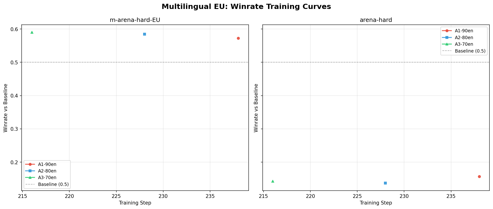
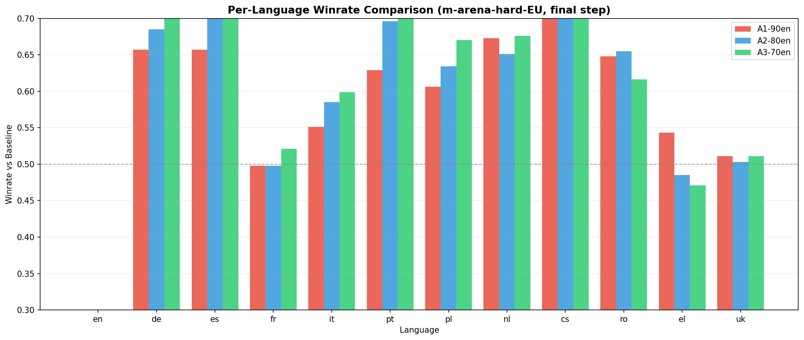
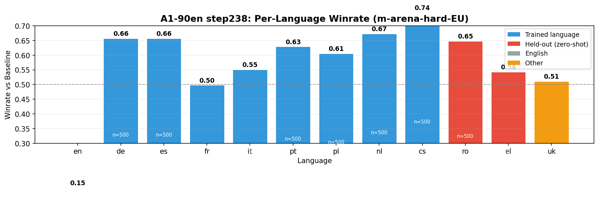
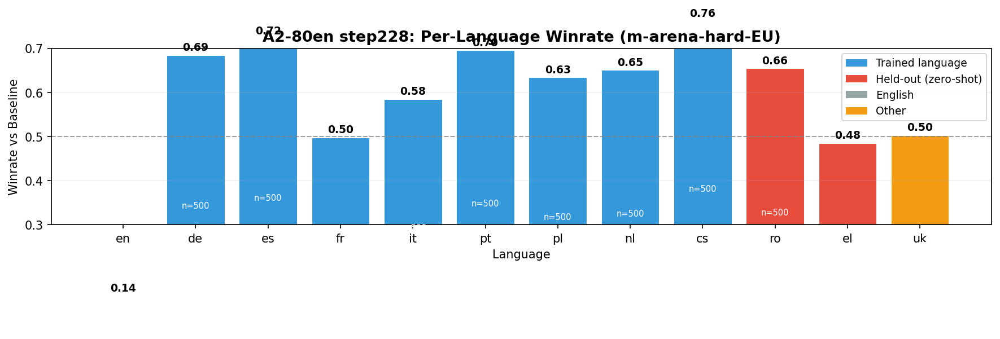
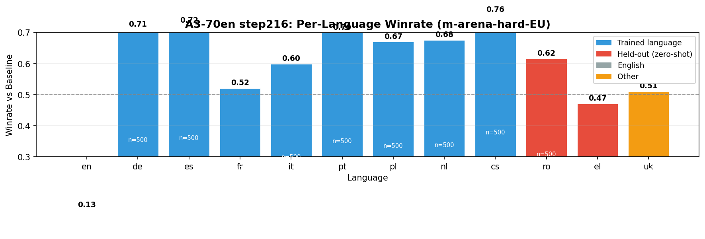

# Multilingual EU Fine-tuning: Evaluation Results

Evaluation results for multilingual EU fine-tuning experiments. All models continue training from the instruct SFT checkpoint (`dolci-instruct-sft-v2-horeka`) on mixtures of English + EU-language data.

## Setup

| | |
|---|---|
| **Base checkpoint** | `checkpoints/ferreira/olmo3-7b-sft/dolci-instruct-sft-v2-horeka` |
| **Baseline** | `models/baselines/Olmo-3-7B-Instruct-SFT` |
| **Judge** | `Qwen/Qwen3-30B-A3B-Instruct-2507` (winrate mode, fixed ordering) |
| **Benchmarks** | m-arena-hard-EU (6000 prompts, 12 EU languages), arena-hard (500 prompts, English) |
| **Training languages** | de, es, fr, it, pt, pl, nl, cs |
| **Held-out languages** | ro, el (zero-shot transfer test) |
| **Date** | 2026-03-06 |

### Experiment matrix

| Experiment | En/EU ratio | Total samples | Data sources | Cluster |
|---|---|---|---|---|
| A1-90en | 90/10 | 94.7k | fusion-synth | kislurm |
| A2-80en | 80/20 | 94.7k | fusion-synth | kislurm |
| A3-70en | 70/30 | 94.7k | fusion-synth | kislurm |
| B1-90en | 90/10 | 491k | fusion-synth + wildchat + lmsys-chat + oasst2 | kislurm + HoreKa |
| B2-80en | 80/20 | 473k | fusion-synth + wildchat + lmsys-chat + oasst2 | HoreKa |

---

## Winrate: m-arena-hard-EU vs arena-hard

Winrate of our model vs the instruct baseline. 50% = parity. Values > 50% mean our model is better.

| Experiment | Step | m-arena-hard-EU WR% | arena-hard WR% (English) | Battles (EU) | Battles (EN) |
|---|---:|---:|---:|---:|---:|
| A1-90en | 238 | **57.2%** (+7.2pp) | 15.7% (-34.3pp) | 6000 | 500 |
| A2-80en | 228 | **58.5%** (+8.5pp) | 13.7% (-36.3pp) | 6000 | 500 |
| A3-70en | 216 | **59.0%** (+9.0pp) | 14.3% (-35.7pp) | 6000 | 500 |
| B1-90en | _tbd_ | _pending_ | _pending_ | 6000 | 500 |
| B2-80en | _tbd_ | _pending_ | _pending_ | 6000 | 500 |

### Observations

- Strong EU language gains across all experiments (+7 to +9pp)
- More EU data helps marginally: A3 (30%) > A2 (20%) > A1 (10%)
- **Severe English regression** (~14-16% winrate on arena-hard, -34 to -36pp)
- English degradation is roughly constant regardless of EU ratio (10% vs 30%)

---

## Per-Language Winrate: m-arena-hard-EU

Winrate broken down by language. [T] = trained, [H] = held-out (zero-shot), [E] = English.

| Language | A1-90en | A2-80en | A3-70en | B1-90en | B2-80en |
|---|---:|---:|---:|---:|---:|
| en [E] | 14.9% | 13.9% | 12.9% | _pending_ | _pending_ |
| de [T] | 65.7% | 68.5% | **71.0%** | _pending_ | _pending_ |
| es [T] | 65.7% | **72.2%** | **72.2%** | _pending_ | _pending_ |
| fr [T] | 49.8% | 49.8% | 52.1% | _pending_ | _pending_ |
| it [T] | 55.1% | 58.5% | 59.9% | _pending_ | _pending_ |
| pt [T] | 62.9% | 69.6% | **70.0%** | _pending_ | _pending_ |
| pl [T] | 60.6% | 63.4% | **67.0%** | _pending_ | _pending_ |
| nl [T] | 67.3% | 65.1% | 67.6% | _pending_ | _pending_ |
| cs [T] | **74.5%** | **76.2%** | **75.7%** | _pending_ | _pending_ |
| ro [H] | 64.8% | 65.5% | 61.6% | _pending_ | _pending_ |
| el [H] | 54.3% | 48.5% | 47.1% | _pending_ | _pending_ |
| uk | 51.1% | 50.3% | 51.1% | _pending_ | _pending_ |

### Per-language observations

- **Czech** is the biggest winner (74-76%) — possibly because it's underrepresented in the baseline
- **French** barely moves (~50%) despite being a trained language — may need more fr data or higher-quality fr data
- **Romanian** [held-out] transfers well (62-66%) — Romance family cross-lingual transfer from es/fr/it/pt
- **Greek** [held-out] doesn't transfer (47-54%) — different script limits cross-lingual transfer
- **Ukrainian** stays neutral (~51%) — Cyrillic script, not closely related to training languages
- **English** drops dramatically (13-15%) — catastrophic forgetting from continued training

---

## Plots











---

## Rubric Scores: m-arena-hard-EU

_Rubric evaluation not yet run. To run:_
```bash
sbatch oellm/experiments/multilingual_eu/run_single_eval.sh A1-90en 238 rubric fixed
```

---

## Key Questions & Answers (Track A)

1. **Does more EU data help?** Yes, marginally. A3 (30% EU) = 59.0% > A2 (20%) = 58.5% > A1 (10%) = 57.2%
2. **English regression?** Yes, severe. All experiments drop to ~14-16% on arena-hard. The English degradation is roughly constant regardless of EU ratio, suggesting the issue is continued training itself rather than the EU data proportion.
3. **Zero-shot transfer?** Mixed. Romanian (Latin script, Romance family) transfers well (62-66%). Greek (Greek script) does not (47-54%).
4. **Scale matters?** Track B results pending (B1 training in progress on kislurm + HoreKa).

### Next steps

- Investigate English regression: is it from continued training or from the EU data?
  - Run a **control experiment**: continue training with 100% English (same total samples) to isolate the effect
- Track B results (B1-90en, B2-80en) will show if more diverse data sources help
- Consider mixing in English data from the original Dolci training set to mitigate forgetting

---

## Results paths

| Experiment | Results directory |
|---|---|
| A1-90en | `oellm/evaluations/benchmarks/OpenJury/results/multilingual_eu/multilingual-eu-A1-90en-winrate-step238-Olmo-3-7B-Instruct-SFT-20260306_000054` |
| A2-80en | `oellm/evaluations/benchmarks/OpenJury/results/multilingual_eu/multilingual-eu-A2-80en-winrate-step228-Olmo-3-7B-Instruct-SFT-20260306_000056` |
| A3-70en | `oellm/evaluations/benchmarks/OpenJury/results/multilingual_eu/multilingual-eu-A3-70en-winrate-step216-Olmo-3-7B-Instruct-SFT-20260306_000056` |

---

<details><summary>Helper code (click to expand)</summary>

```python
import json
from pathlib import Path
import pandas as pd

RESULTS_ROOT = Path("oellm/evaluations/benchmarks/OpenJury/results/multilingual_eu")

def load_winrate(results_dir):
    rows = []
    for f in sorted((RESULTS_ROOT / results_dir).rglob("results-*.json")):
        d = json.loads(f.read_text())
        if d.get("eval_mode") != "winrate": continue
        rows.append({"Benchmark": d["dataset"], "Baseline WR%": d["winrate"]*100,
            "Ours WR%": (1-d["winrate"])*100, "Battles": d["num_battles"]})
    return pd.DataFrame(rows)

def load_per_language(results_dir, dataset="m-arena-hard-EU"):
    """Load per-language winrates from annotations CSV."""
    import re
    for f in sorted((RESULTS_ROOT / results_dir).rglob(f"{dataset}-*-annotations.csv")):
        df = pd.read_csv(f)
        df["lang"] = df["instruction_index"].str.rsplit("-", n=1).str[-1]
        def parse_winner(text):
            if not isinstance(text, str): return None
            a = re.search(r"score_A:\s*(\d+)", text)
            b = re.search(r"score_B:\s*(\d+)", text)
            if not a or not b: return None
            sa, sb = int(a.group(1)), int(b.group(1))
            return "B" if sb > sa else ("A" if sa > sb else "tie")
        df["winner"] = df["judge_completion"].apply(parse_winner)
        df = df.dropna(subset=["winner"])
        results = []
        for lang, g in df.groupby("lang"):
            n = len(g)
            wins = (g["winner"] == "B").sum()
            ties = (g["winner"] == "tie").sum()
            results.append({"Language": lang, "WR%": round((wins + 0.5*ties)/n*100, 1), "N": n})
        return pd.DataFrame(results).sort_values("Language")
```

</details>
