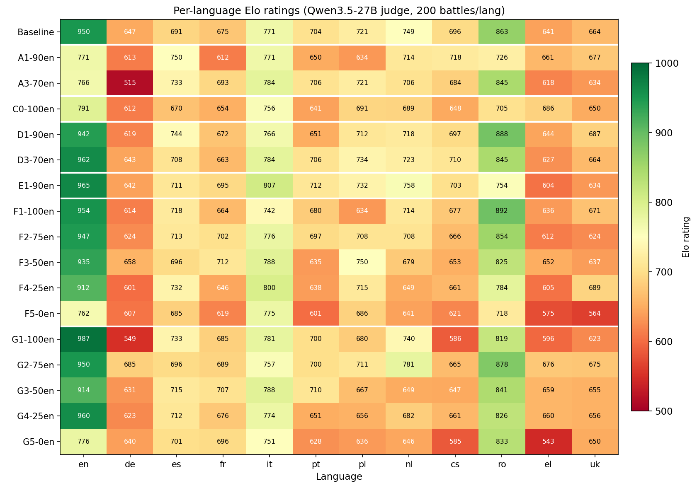
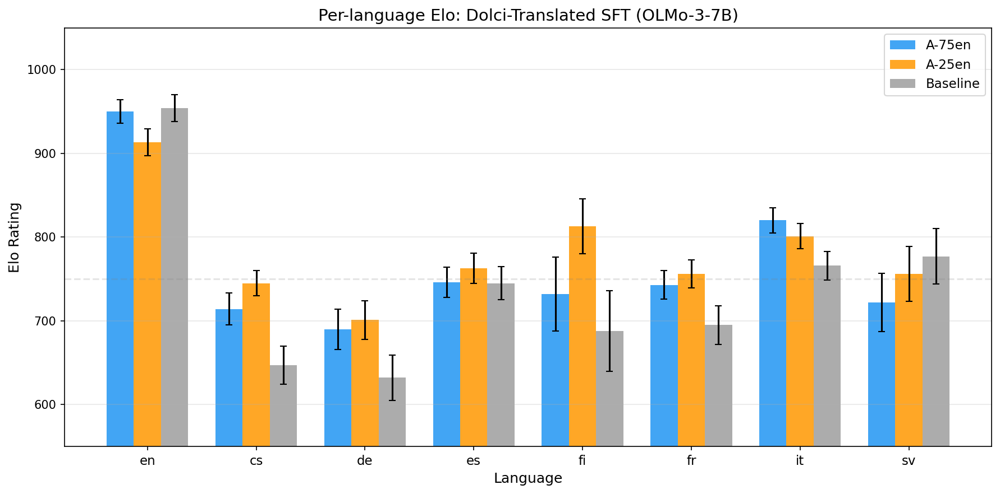
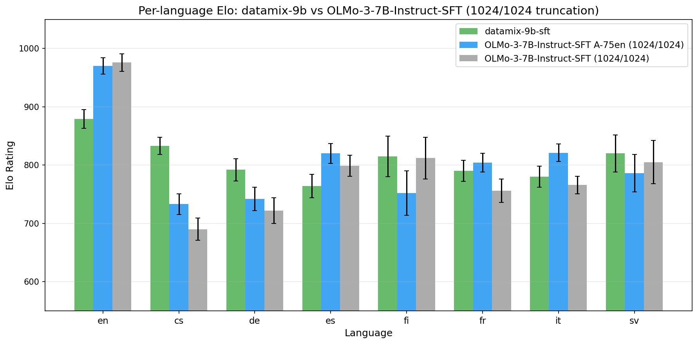

# LLMs4EU WP4 — 2026-04-28

**Presenter:** Fabio (David out)
**Slides:** https://docs.google.com/presentation/d/17fm2S4wqtE3fFytk5wfrlrOcI_f1SOqhb_O6QKO4IfU/edit

---

## Slide 1 — Recap
- Presenting today on behalf of David and myself
- Last meeting we had reproduced OLMo-3-7B-Instruct-SFT and validated it with LLM-as-a-judge using OpenJury
- Plan was to start continued SFT on mixes of English and EU-language data
- This update covers what came out of that, plus a few new threads

---

## Slide 2 — Multilingual SFT: language-ratio sweep
- Continued SFT on different English / EU language ratios [1]
- Replaying the base SFT's own English data prevents English forgetting
- Sweet spot is around 75% English / 25% EU
- Cross-lingual transfer is script-dependent (Romanian transfers, Greek does not)

---

## Slide 3 — High-quality Dolci translations (gemma-3-27b-it)
- Switched our translated EU data from NLLB-distilled-600M to gemma-3-27b-it Dolci translations in 7 EU languages [2]
- Two matched-compute SFT runs at 75/25 and 25/75 English-to-translated
- Both improve non-English without sacrificing English — the headline result this round
- Next: quality-filter the translated pool, then run the Think-SFT analogue

---

## Slide 4 — Qualitative completions viewer
- Public side-by-side viewer for the consortium [3]
- 12 checkpoints × 7 EU languages × 698 LMArena prompts
- Slider scrubs training progression in lockstep across the two SFT runs

---

## Slide 5 — Datamix-9B Instruct SFT (OpenEuroLLM 9B alpha)
- First post-training of the OpenEuroLLM 9B alpha, same 75/25 SFT recipe as the OLMo runs [4]
- At matched context length, beats our OLMo SFT on most non-English languages
- Multilingual pretraining mix carries through into post-training
- English still lags, primarily due to the alpha's 2048-token context limit

---

## Slide 6 — JudgeArena (NeurIPS submission)
- Open-source unified framework for LLM-judge evaluation [5]
- Now covers AlpacaEval, Arena-Hard v0.1/v2.0, MT-Bench, m-Arena-Hard v0.1/v2.0 (23 languages)
- Tuned open-weight judges match closed-model judges in meta-evaluations
- New: simulated LMArena Elo from existing human annotations; fluency-completion mode for base models

---

## References
- [1] multilingual_eu results: https://github.com/ferreirafabio/open-instruct/blob/main/oellm/experiments/multilingual_eu/results/multilingual_eu_results.md
- [2] dolci_translated results: https://github.com/ferreirafabio/open-instruct/blob/main/oellm/experiments/multilingual_eu/results/dolci_translated_results.md
- [3] Qualitative viewer: https://ferreirafabio.github.io/olmo3-multilingual-dolci-sft-progression/
- [4] datamix_9b results: https://github.com/ferreirafabio/open-instruct/blob/main/oellm/experiments/multilingual_eu/results/datamix_9b_sft_results.md
- [5] OpenJury / JudgeArena: https://github.com/OpenEuroLLM/OpenJury
